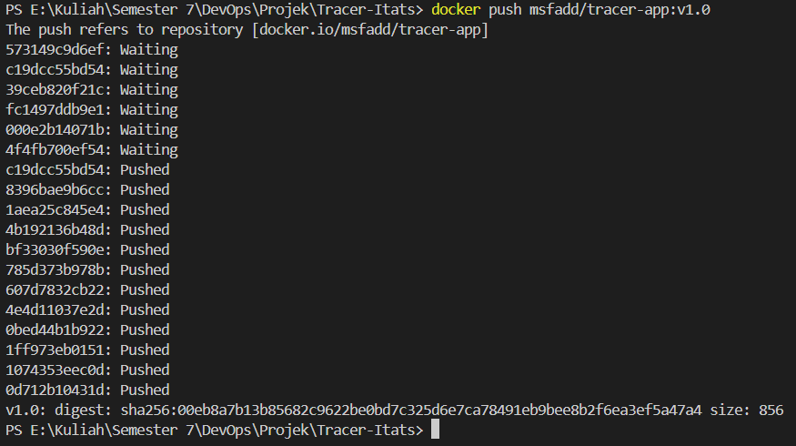
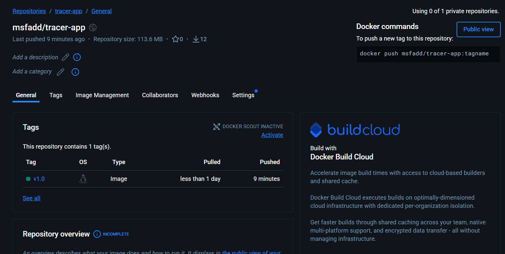

# Panduan Deployment dan Rilis Sistem (Deployment Guide)

## I. Filosofi Deployment: Build-Ship-Run
Strategi deployment pada proyek Tracer Alumni ITATS Kelompok 5 mengadopsi prinsip *Build-Ship-Run*. Prinsip ini memisahkan proses pembuatan artefak (Build), pengiriman artefak ke registri (Ship), dan eksekusi aplikasi (Run). Pendekatan ini dipilih untuk menjamin bahwa kode yang berjalan di laptop pengembang adalah kode yang sama persis (identik) dengan yang berjalan di server produksi, meminimalisir risiko *"It works on my machine"*.

1.  **Build:** Proses kompilasi kode sumber dan dependensi menjadi sebuah Docker Image yang *immutable* (tidak dapat diubah).
2.  **Ship:** Proses mengunggah image tersebut ke Docker Hub sebagai *Single Source of Truth*.
3.  **Run:** Proses menarik image dari Docker Hub ke server tujuan dan menjalankannya menggunakan orkestrator (Docker Compose).

## II. Prosedur Containerization (Tahap 4)
Sesuai dengan persyaratan **Tahap 4**, kami telah melakukan proses *containerization* aplikasi Laravel menggunakan teknik *Multi-stage Build*. Teknik ini membagi proses build menjadi dua tahap:
* **Stage 1 (Builder):** Menggunakan image `composer` untuk mengunduh dependensi PHP. Tahap ini menghasilkan folder `vendor` yang gemuk karena berisi cache dan metadata.
* **Stage 2 (Runtime):** Menggunakan image `php:8.2-fpm-alpine` yang sangat ringan. Kami hanya menyalin hasil folder `vendor` dari Stage 1, membuang sisa-sisa cache Composer yang tidak diperlukan di produksi.

Hasilnya, kami berhasil mereduksi ukuran image aplikasi secara signifikan, menjadikannya lebih efisien untuk proses transfer jaringan (*push/pull*) dan menghemat ruang penyimpanan di server.

### Langkah-Langkah Build & Push Manual
Berikut adalah prosedur teknis yang telah dilaksanakan untuk merilis versi `v1.0` ke Docker Hub:

1.  **Login ke Registry:**
    Langkah pertama adalah melakukan autentikasi ke Docker Hub untuk mendapatkan token akses.
    ```bash
    docker login
    ```

2.  **Build & Tagging Image:**
    Kami membangun image dengan menunjuk secara spesifik ke `docker/Dockerfile` karena struktur proyek mengikuti standar folder `docker/`. Kami memberikan *tag* `v1.0` untuk menandai versi rilis stabil pertama dengan namespace user `msfadd`.
    ```bash
    docker build -f docker/Dockerfile -t msfadd/tracer-app:v1.0 .
    ```
    *Catatan:* Proses ini memanfaatkan fitur *Docker Layer Caching*, sehingga jika tidak ada perubahan pada `composer.lock`, Docker akan menggunakan cache yang ada untuk mempercepat proses build.

3.  **Push ke Docker Hub:**
    Setelah image berhasil dibangun, kami mengunggahnya ke repositori publik Docker Hub.
    ```bash
    docker push msfadd/tracer-app:v1.0
    ```

### Bukti Eksekusi (Screenshot)
Berikut adalah bukti terminal bahwa image berhasil diunggah ke repositori `msfadd/tracer-app`:





## III. Otomatisasi Deployment (Staging Environment)
Sesuai persyaratan **Tahap 5**, selain deployment manual, kami juga merancang skenario deployment otomatis untuk lingkungan *Staging*.

1.  **Triggering:** Pipeline CI/CD dikonfigurasi untuk memantau perubahan pada branch `main`.
2.  **Validation:** Setiap *commit* baru wajib melewati *Quality Gate* (Unit Test & Static Analysis).
3.  **Automated Rollout:** Jika validasi lolos, GitHub Actions akan secara otomatis menjalankan perintah SSH ke server staging untuk melakukan:
    * `docker pull msfadd/tracer-app:latest`
    * `docker-compose up -d --no-deps --build app`
    
Hal ini memungkinkan tim QA atau dosen penguji untuk selalu melihat progres fitur terbaru secara *real-time* tanpa intervensi manual dari tim pengembang.

## IV. Deployment Production dengan Manual Approval
Untuk lingkungan Produksi (Production), kami menerapkan kebijakan keamanan yang lebih ketat dengan mekanisme **Manual Approval**.

Sebelum kode dideploy ke produksi:
1.  **Quality Check:** Seluruh pengujian kualitas kode dan pemindaian kerentanan pada image harus berstatus *Pass*.
2.  **Approval Gate:** Personel yang berwenang (Lead Developer) wajib meninjau laporan pengujian di GitHub Actions dan memberikan persetujuan manual melalui antarmuka CI/CD. Hal ini mencegah terjadinya *accidental deployment* yang dapat merusak integritas data alumni.
3.  **Deployment:** Setelah disetujui, pipeline akan melakukan pembaruan pada server produksi menggunakan strategi *Rolling Update* (jika menggunakan Swarm/K8s) atau *Recreate* (untuk Docker Compose) guna meminimalisir *downtime*.

## V. Verifikasi Post-Deployment dan Health Check
Setelah deployment selesai, sistem secara otomatis menjalankan **Health Check**. Hal ini dilakukan untuk memastikan bahwa:
* Container Nginx dan PHP-FPM dapat berkomunikasi dengan benar tanpa error 502 Bad Gateway.
* Koneksi ke database utama (`db_main`) dan database analitik (`db_analytics`) telah terjalin sempurna.
* Endpoint utama aplikasi memberikan respon status 200 OK.

Jika terjadi kegagalan pada tahap ini, prosedur *rollback* akan segera dipicu untuk memulihkan layanan ke versi stabil sebelumnya (misal: dari `v1.1` kembali ke `v1.0`).